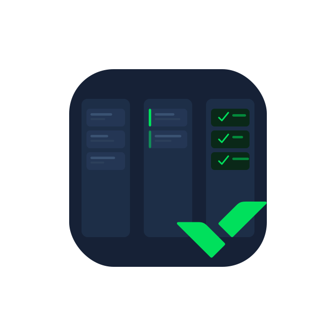

<div align="center">
  
  <h1>TaskWrike</h1>
  <p>A read-only Kanban desktop app for your Wrike tasks — built with Tauri + React.</p>

  
  
  
  
</div>

---

## ✨ Features

| Feature | Description |
|---|---|
| 🔐 **Wrike OAuth 2.0** | Full login flow via Wrike authorization |
| 📋 **Kanban Board** | Drag-and-drop across Pending → In Progress → In Review → Done |
| 🔍 **Task Detail Panel** | Click any card to see description & comments fetched live from Wrike |
| 📅 **Calendar View** | Monthly grid of tasks with due dates |
| 📊 **Reports** | Stats: total, high priority, overdue tasks |
| 🗂 **Spaces** | Browse your Wrike workspaces |
| 📬 **Inbox** | Recent activity log |
| ➕ **Local Tasks** | Create tasks that live only on your device (not synced to Wrike) |
| 🌐 **i18n** | English / Spanish — switchable in Settings |
| 🌙 **Dark Mode** | Light / Dark theme toggle in Settings |
| 🔄 **Auto-sync** | Polls Wrike every 30 seconds |
| 👁 **Read-only** | Never writes to the Wrike API |

---

## 🏗 Tech Stack

- **[Tauri 2](https://tauri.app/)** — Native desktop wrapper (Rust)
- **[React 19](https://react.dev/)** + **TypeScript**
- **[Vite](https://vitejs.dev/)** — Frontend build tool
- **[@dnd-kit](https://dndkit.com/)** — Drag-and-drop
- **[localForage](https://localforage.github.io/localForage/)** — Local persistence
- **[React Router 6](https://reactrouter.com/)** — Client-side routing
- **Tailwind CSS** — Utility-first styling

---

## 🚀 Getting Started

### Prerequisites

- [Node.js](https://nodejs.org/) ≥ 18
- [Rust](https://rustup.rs/) (for Tauri)
- A [Wrike developer app](https://www.wrike.com/frontend/apps/index.html)

### 1. Clone & install

```bash
git clone https://github.com/your-username/taskwrike.git
cd taskwrike/app
npm install
```

### 2. Configure environment

Create `app/.env` from the example:

```bash
cp app/.env.example app/.env
```

Fill in your Wrike credentials:

```env
VITE_WRIKE_CLIENT_ID=your_client_id
VITE_WRIKE_CLIENT_SECRET=your_client_secret
VITE_WRIKE_REDIRECT_URI=http://localhost:5173/oauth/callback
# Optional: skip OAuth during development
VITE_WRIKE_PERMANENT_TOKEN=your_permanent_token
```

> **Where to get these:** [Wrike API Apps](https://www.wrike.com/frontend/apps/index.html) → Create new app → OAuth 2.0

### 3. Run in development

```bash
cd app
npm run tauri dev
```

---

## 📦 Building for production

```bash
cd app
npm run tauri build
```

Output appears in `app/src-tauri/target/release/bundle/`:

| OS | File |
|---|---|
| macOS | `.dmg` and `.app` |
| Windows | `.msi` and `.exe` |
| Linux | `.deb` and `.AppImage` |

> Each platform must be built **on its own OS**. Use [GitHub Actions + tauri-action](https://github.com/tauri-apps/tauri-action) for cross-platform CI/CD.

---

## 🔑 Sharing with teammates

Each colleague needs their own Wrike connection. The easiest way for internal distribution:

1. They generate a **Permanent Token** at `Wrike → Profile → Apps & Integrations → API Apps`
2. Open **Settings → Wrike Account** in the app and paste it

---

## 📁 Project Structure

```
taskwrike/
└── app/
    ├── public/               # Static assets & app icon (SVG)
    ├── src/
    │   ├── components/       # Sidebar, CreateTaskModal, TaskDetailPanel
    │   ├── contexts/         # AppContext (i18n + theme)
    │   ├── pages/            # Dashboard, SpacesPage, CalendarPage, …
    │   └── services/         # wrikeApi.ts
    └── src-tauri/
        ├── icons/            # App icons (auto-generated from SVG)
        └── src/lib.rs        # Tauri Rust entry point
```

---

## 🛡 Privacy & Security

- **Read-only**: The app never creates, updates, or deletes anything in Wrike.
- **Tokens**: Stored in `localStorage` on the user's device only.
- **No backend**: This is a fully local desktop app with direct API calls.

---

## 📄 License

MIT © Sergio Tijero
